# Heaptop

[](https://components.espressif.com/components/pedroluisdionisiofraga/heaptop)
[](https://github.com/PedroLuisDionisioFraga/esp32s3-heaptop/actions/workflows/build.yml)
[](https://github.com/PedroLuisDionisioFraga/esp32s3-heaptop/actions/workflows/host_tests.yml)
[](LICENSE)


An htop-like heap and task monitor for ESP-IDF, driven over the serial console. Heaptop answers three questions about a running firmware:

- **Is it leaking?** Per-task heap growth flags suspects live, and a leak capture groups every allocation that was never freed by call stack.
- **Is the heap fragmenting?** Per-region fragmentation, largest free block trends and a free-block size histogram.
- **How does it behave?** CPU % per task and per core, stack high-water marks, allocation and free rates, and a log of failed allocations.

Everything is built on ESP-IDF's own instrumentation (task tracking, heap tracing, heap hooks, FreeRTOS run-time stats), sampled by one low-priority task that allocates nothing after start-up.

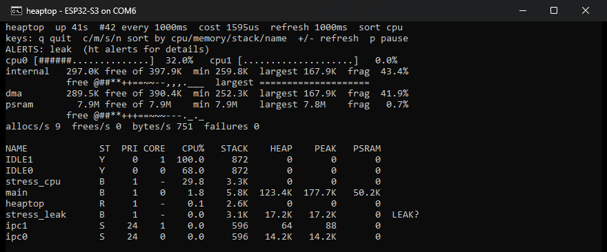

*`ht top` on an ESP32-S3 N16R8 running [examples/basic](examples/basic). Every screenshot in this README is real: the board's UART console on COM6, shown in a Windows console window.*

## Contents

- [Try it in five minutes](#try-it-in-five-minutes)
- [Heap basics in one minute](#heap-basics-in-one-minute)
- [Guided examples](#guided-examples)
  1. [Is my heap healthy?](#1-is-my-heap-healthy)
  2. [Watch fragmentation happen](#2-watch-fragmentation-happen)
  3. [Find a memory leak](#3-find-a-memory-leak)
  4. [Who is using the CPU?](#4-who-is-using-the-cpu)
  5. [Is a task about to overflow its stack?](#5-is-a-task-about-to-overflow-its-stack)
  6. [Why did malloc return NULL?](#6-why-did-malloc-return-null)
  7. [Feed a host tool](#7-feed-a-host-tool)
- [Use it in your project](#use-it-in-your-project)
- [Commands](#commands)
- [Configuration](#configuration)
- [Stream protocol](#stream-protocol)
- [Alerts](#alerts)
- [API](#api)
- [Measured on hardware](#measured-on-hardware)
- [Caveats](#caveats)
- [Development](#development)

## Try it in five minutes

The [basic example](examples/basic) is a serial console with every `ht` command, plus a `stress` command that misbehaves on demand so there is something to look at:

```bash
idf.py create-project-from-example "pedroluisdionisiofraga/heaptop:basic"
cd basic
idf.py set-target esp32s3
idf.py -p PORT flash monitor
```

Type `ht` to list the commands. They all live under `ht`, so they never collide with your own:

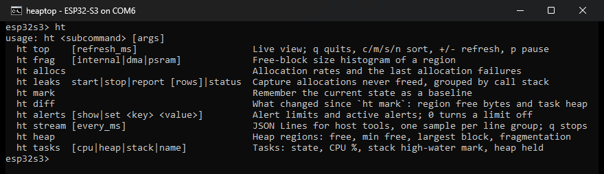

The `stress` workloads used in the examples below:

| Command | What it does |
|---|---|
| `stress leak <bytes> <ms>` | task `stress_leak` mallocs `<bytes>` every `<ms>` and never frees them |
| `stress frag <n>` | leaves `n` holes of 512 bytes between 32-byte blocks in internal RAM |
| `stress burst <n>` | `n` malloc/free pairs right now |
| `stress stack <bytes>` | task `stress_stack` uses `<bytes>` of its 4 KB stack |
| `stress fail <bytes>` | an internal RAM allocation that cannot succeed |
| `stress cpu <pct>` | task `stress_cpu` is busy `<pct>`% of the time |
| `stress stop` | ends every workload and frees what it kept |

## Heap basics in one minute

Four numbers describe a heap region, and heaptop shows all four:

| Number | Meaning | Why it matters |
|---|---|---|
| **FREE** | bytes free right now | how much room is left |
| **MIN FREE** | the lowest FREE has been since boot | how close the firmware ever came to running out |
| **LARGEST** | the biggest single free block | the largest `malloc()` that can succeed right now |
| **FRAG** | share of free bytes outside the largest block: `1 - LARGEST / FREE` | high means plenty free, but only in small pieces |

A picture of the heap after `stress frag 150` (from [example 2](#2-watch-fragmentation-happen)):

```text
internal RAM (not to scale)

|used|free 512|s|free 512|s|free 512|s| ... |used ...|         free 187.9K         |
      \_______ 150 holes, 72.4K in all _______/        \____ the largest block ___/

FREE = 338.0K    LARGEST = 187.9K    FRAG = 1 - 187.9 / 338.0 = 44%
```

A `malloc(200 * 1024)` fails here even though 338 KB are free: no single piece is that big.

The regions:

- **internal**: the chip's own SRAM. It is fast, and it is the only RAM that ISRs and most DMA can use.
- **dma**: the part of internal RAM that DMA can reach. It overlaps `internal`, so do not add the two up.
- **psram**: external RAM (8 MB on the board below). It is large but slower.

One more rule explains many surprises: **memory is charged to the task that allocated it**. The stack of a new task counts for the task that called `xTaskCreate()`, and heaptop's own buffers count for the task that called `heaptop_init()`.

## Guided examples

Each example follows the same steps: the question, the commands, the real output, and how to read it. Each one ends with what to do in your own firmware. The numbers come from the screenshots and change a little from run to run.

### 1. Is my heap healthy?

Right after boot, before any `stress`:

```text
ht heap
```

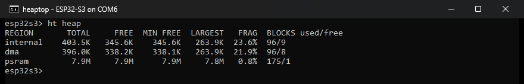

How to read it:

- **internal**: 345.6K of 403.5K is free.
- **MIN FREE** equals FREE (345.6K), so nothing has squeezed the heap yet.
- **LARGEST** is 263.9K, so FRAG is `1 - 263.9 / 345.6 = 23.6%`. A few percent up to about 30% is normal after boot: drivers and the console keep blocks spread around.
- **psram**: almost all 7.9 MB is free, in one block (0.8%).
- **BLOCKS** counts used and free blocks. Many free blocks means many holes.

> **In your firmware:** run `ht heap` after your heaviest scenario (Wi-Fi connect, OTA, peak traffic). MIN FREE is the number to watch: it keeps the worst moment even after memory comes back.

### 2. Watch fragmentation happen

`stress frag 150` allocates 150 pairs (a 512-byte block, then a 32-byte block) and frees every 512-byte block. What stays is 150 holes pinned apart by small blocks. `ht heap` reads the latest sample, taken once a second, so wait a second before running it:

```text
stress frag 150
ht heap
```

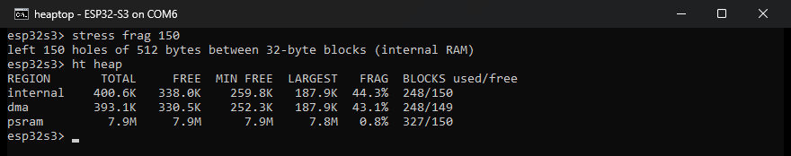

Compare with [example 1](#1-is-my-heap-healthy):

| | Before | After | What happened |
|---|---|---|---|
| FREE | 345.6K | 338.0K | only the 150 small blocks (and their headers) are still held |
| LARGEST | 263.9K | 187.9K | the holes were cut from the largest block |
| FRAG | 23.6% | 44.3% | almost half the free memory is now in pieces |
| free blocks | 9 | 150 | one hole per pair |
| MIN FREE | 345.6K | 259.8K | the low point, while both blocks of every pair were held |

**FREE barely moved, but LARGEST fell by 76 KB.** That is the signature of fragmentation. `ht frag` shows the pieces:

```text
ht frag
```

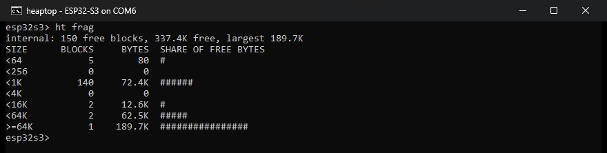

- The `<1K` row holds 140 holes of about 512 bytes (72.4K in all): the holes `stress frag` made.
- The `>=64K` row is the largest block. It walks the heap right now, and counts raw block sizes. `ht heap` instead shows the largest size `malloc()` can return, which is a little smaller.

`stress stop` frees the small blocks, and the holes merge back into large free blocks.

> **In your firmware:** fragmentation comes from long-lived and short-lived allocations mixed together. To reduce it:
> - Allocate long-lived buffers once, at start-up.
> - Use a pool or a static array for many objects of the same size.
> - Move big buffers that do not need internal RAM to PSRAM.

### 3. Find a memory leak

`stress leak 128 250` starts task `stress_leak`, which does this four times a second and never frees:

```c
void *p = malloc(s_stress.leak_bytes);  // stress_cmds.c:67
```

`stress cpu 30` also starts, to give [example 4](#4-who-is-using-the-cpu) some CPU load to show.

**Step 1: set a baseline, start a capture, and wait.**

```text
ht mark
ht leaks start
stress leak 128 250
stress cpu 30
```

About 20 seconds later, the alert shows up on its own:

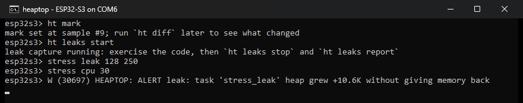

- `ht mark` saves the current state, so `ht diff` can later show what changed.
- `ht leaks start` records every allocation that is not freed afterwards.
- The alert needs 20 samples of history, and growth in every part of it, so a single large buffer never triggers it.

`ht alerts` lists every limit and which alerts are active now:

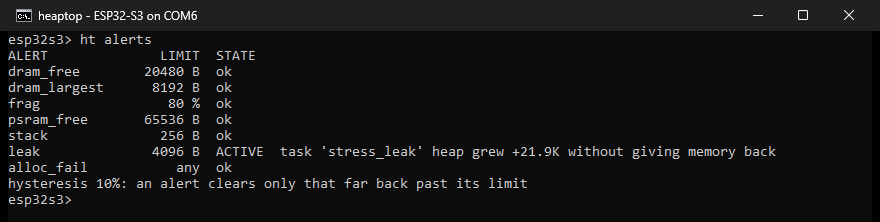

**Step 2: which task?**

```text
ht tasks heap
```

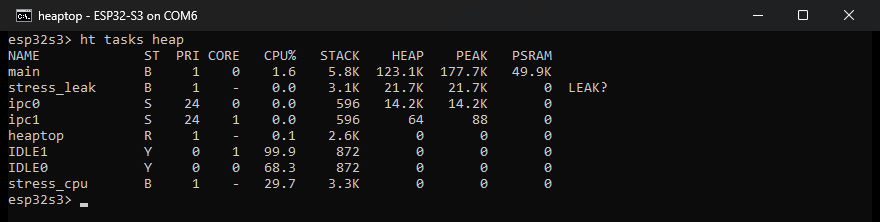

- `stress_leak` holds 21.7K and is marked `LEAK?`: its heap only goes up.
- `main` holds more (123.1K) but is not flagged. Its heap is large but flat: the console, and heaptop's buffers, which [are charged to `main`](#heap-basics-in-one-minute).
- `PSRAM` is the part of `HEAP` that lives in external RAM.

**Step 3: which line of code?**

```text
ht leaks stop
```

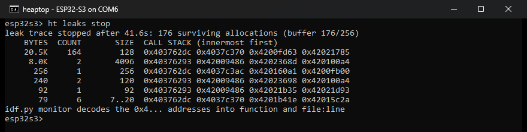

Each row groups the surviving allocations that share a call stack, largest first. `idf.py monitor` decodes every `0x4...` address as it prints. Here they are decoded with `xtensa-esp32s3-elf-addr2line`:

| Row | Call stack (after `heap_caps_malloc` / `malloc`) | Verdict |
|---|---|---|
| 164 × 128 B | `_leak_task` at `stress_cmds.c:67` | **the leak** |
| 2 × 4096 B | `xTaskCreatePinnedToCore` ← `_start` at `stress_cmds.c:127` | stacks of the two tasks started during the capture |
| 1 × 256 B | `calloc` ← `linenoise` ← `app_main` | the command line being typed |
| 2 × 120 B | `xTaskCreatePinnedToCore` ← `_start` | the two tasks' control blocks |
| 1 × 92 B | `xQueueGenericCreate` ← `xQueueCreateMutex` | a mutex created once |
| 6 × 7..20 B | `strdup` ← `linenoiseHistoryAdd` | console history, kept on purpose |

Not every surviving allocation is a leak. Task stacks, history and caches survive on purpose. **A leak is the row that keeps growing** when you repeat the capture.

**Step 4: how much, in total?**

```text
ht diff
```

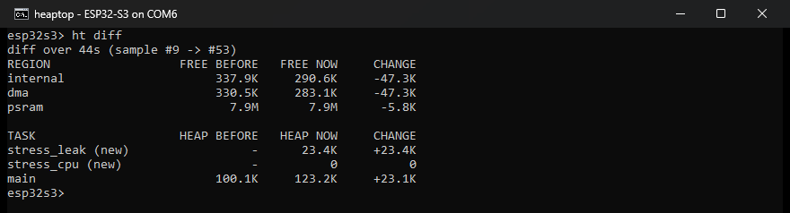

The numbers add up. Internal RAM fell by 47.3K:

- `stress_leak` took 23.4K: the leak.
- `main` took 23.1K. That is heaptop's leak-trace records (about 14K, allocated by `ht leaks start` and kept until reboot), plus the stacks and control blocks of the two tasks `main` created.
- PSRAM fell by 5.8K, though no task allocated PSRAM. That is task tracking's own bookkeeping, about 60 bytes per live allocation, which appears in no task's row.

`stress stop` ends both tasks and frees what they kept.

> **In your firmware:** the same recipe works for any suspect.
> 1. Watch `ht top` for `LEAK?`, or for a FREE sparkline that only goes down.
> 2. `ht mark` and `ht leaks start`.
> 3. Repeat the suspect action several times (connect/disconnect, open/close, one request).
> 4. `ht leaks stop`: the row whose count matches your repetitions is the leak.
> 5. `ht diff` to confirm which task kept the memory.
>
> `ht leaks report` also works while the capture runs. It pauses the capture for the moment it takes to print.

### 4. Who is using the CPU?

`ht top` is the live view. With `stress cpu 30` and `stress leak 128 250` still running:

```text
ht top
```


Line by line:

1. **Header**: up 41 s, sample #42, a sample every 1000 ms. `cost 1595us` is heaptop's own time per sample: 0.16% of one core.
2. **Keys**: `q` quits; `c`/`m`/`s`/`n` sort by CPU, memory, stack or name; `+`/`-` change the refresh; `p` pauses.
3. **ALERTS**: the leak alert from example 3 is still active.
4. **Core bars**: core 0 is 32% busy. A core's load is 100% minus its idle task: `IDLE0` got 68.0%.
5. **Regions**: each memory region shows FREE, MIN FREE, LARGEST and FRAG, with sparklines of the last 40 samples. Internal free (`@##**++==~~--,,,.___`) slides down while `stress_leak` leaks. The `largest` line stays flat because the leak has not cut into the largest block yet.
6. **Rates**: `allocs/s 9`, `frees/s 0`. More allocations than frees, sample after sample, is the allocator's view of the same leak.
7. **Tasks**: `stress_cpu` uses 29.8%, as asked. CPU % is per core (htop style), so a dual-core chip can add up to 200%. `stress_cpu` has no core affinity (`-`), and FreeRTOS ran it on core 0.

Press `m` to sort by memory:

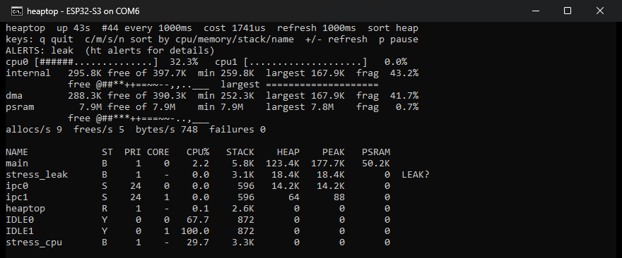

Task states: `R` running, `Y` ready, `B` blocked, `S` suspended, `X` deleted but still holding heap (that memory is leaked by definition).

> **In your firmware:** look for a task with high CPU % that should be waiting. Busy-wait loops and polling without `vTaskDelay()` are the usual cause. If one core is full and the other idle, pin work to the idle core with `xTaskCreatePinnedToCore()`.

### 5. Is a task about to overflow its stack?

The **stack high-water mark (HWM)** is the least free stack a task has ever had, in bytes. It never goes back up. `stress stack 3456` makes task `stress_stack` use 3456 bytes of its 4096-byte stack in one frame:

```text
stress stack 3456
ht tasks stack
```

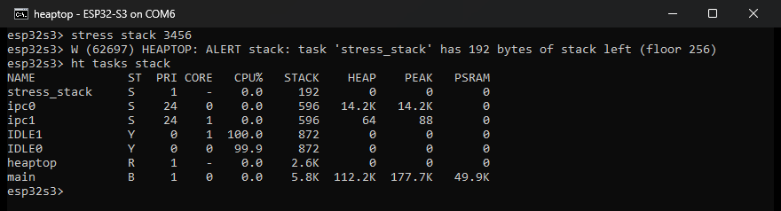

- `stress_stack` has 192 bytes left, so the stack alert fires: it is below the 256-byte floor.
- `ipc0`/`ipc1` at 596 and the idle tasks at 872 are normal for IDF's own tasks. That is why the floor defaults to 256, not 512.

`ht alerts` now shows the stack alert active:

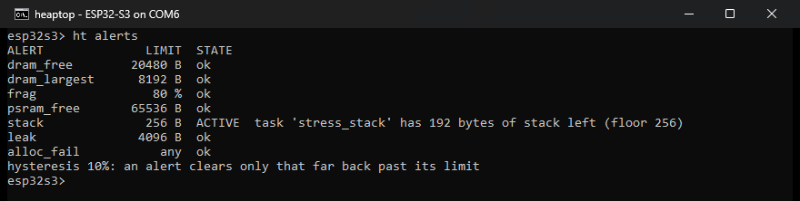

> **In your firmware:** keep at least 512 bytes to 1 KB of HWM in every task, measured after its heaviest path (logging with `printf` of floats is a classic stack eater). Raise the stack size in `xTaskCreate()`, or move large local arrays to `static` or to the heap.

### 6. Why did malloc return NULL?

`stress fail 100000000` asks for 100 MB of internal RAM, which cannot succeed. Then `stress burst 30000` does 30,000 malloc/free pairs as fast as it can:

```text
stress fail 100000000
stress burst 30000
ht allocs
```

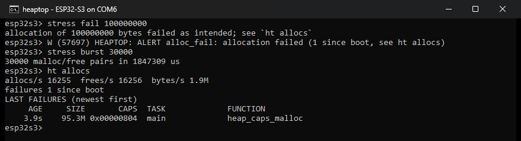

- **The alert** `alloc_fail` fired the moment the allocation failed.
- **The failure log** keeps the last failures:
  - SIZE: 95.3M (100,000,000 bytes).
  - CAPS: `0x804`, which is `MALLOC_CAP_INTERNAL | MALLOC_CAP_8BIT`.
  - TASK: `main`.
  - FUNCTION: `heap_caps_malloc`.
  - AGE: 3.9 s ago.
- **The rates** show the burst: 16,255 allocations and frees per second.

> **In your firmware:** when an allocation fails, compare it with `ht heap`.
> - **SIZE larger than FREE:** you are out of memory.
> - **SIZE larger than LARGEST, but smaller than FREE:** fragmentation ([example 2](#2-watch-fragmentation-happen)).
> - **CAPS asking for internal or DMA memory:** PSRAM does not count for that request.
> - **A huge SIZE:** usually a bug, such as a negative length or an uninitialised variable.

### 7. Feed a host tool

`ht stream` prints the same data as JSON Lines, one object per line, until you press `q`:

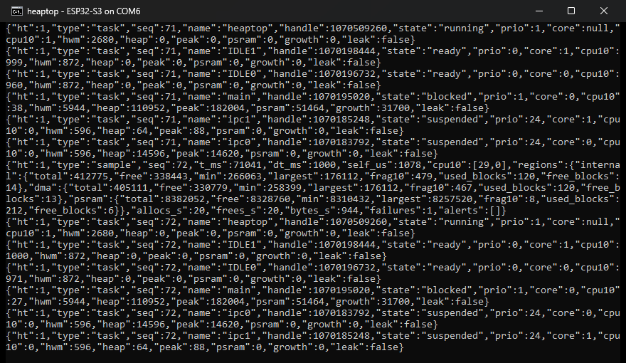

Every heaptop line starts with `{"ht":1,`, so a script can pick them out of normal logs. This Python script (with `pip install pyserial`) prints the internal RAM of five samples:

```python
import json

import serial  # pip install pyserial

port = serial.Serial()
port.port, port.baudrate, port.timeout = 'COM6', 115200, 5
port.dtr = port.rts = False  # opening the port must not reset the board
port.open()
port.write(b'ht stream\r')

samples = 0
while samples < 5:
    line = port.readline().decode(errors='replace').strip()
    if not line.startswith('{"ht":1,'):
        continue  # command echo, prompt, ordinary log lines
    record = json.loads(line)
    if record['type'] == 'sample':
        ram = record['regions']['internal']
        print(f"t={record['t_ms'] // 1000}s  free={ram['free']}  "
              f"largest={ram['largest']}  frag={ram['frag10'] / 10}%")
        samples += 1

port.write(b'q')  # give the console back
port.close()
```

Output from the board:

```text
t=213s  free=338531  largest=176112  frag=47.9%
t=214s  free=338443  largest=176112  frag=47.9%
t=215s  free=338443  largest=176112  frag=47.9%
t=216s  free=338443  largest=176112  frag=47.9%
t=217s  free=338443  largest=176112  frag=47.9%
```

Devices without a console can stream from boot with `CONFIG_HEAPTOP_STREAM_AT_BOOT`. The format is in [Stream protocol](#stream-protocol).

## Use it in your project

Add the component:

```bash
idf.py add-dependency "pedroluisdionisiofraga/heaptop^0.1.0"
```

or in `main/idf_component.yml`:

```yaml
dependencies:
  pedroluisdionisiofraga/heaptop: "^0.1.0"
```

Requires ESP-IDF 6.0 or later. Then start it and register the command:

```c
#include "heaptop.h"

void app_main(void)
{
  ESP_ERROR_CHECK(heaptop_init(NULL));  // Kconfig defaults

  // ... esp_console_init() / your REPL setup ...
  ESP_ERROR_CHECK(heaptop_console_register());  // adds the `ht` command
}
```

Heaptop turns on `CONFIG_FREERTOS_USE_TRACE_FACILITY` itself (it needs `uxTaskGetSystemState()`; the cost is a few bytes per task). Enable the IDF data sources heaptop reads, for example in `sdkconfig.defaults`:

```text
CONFIG_FREERTOS_GENERATE_RUN_TIME_STATS=y
CONFIG_FREERTOS_RUN_TIME_COUNTER_TYPE_U64=y
CONFIG_FREERTOS_VTASKLIST_INCLUDE_COREID=y
CONFIG_HEAP_TASK_TRACKING=y
CONFIG_HEAP_TRACK_DELETED_TASKS=y
CONFIG_HEAP_USE_HOOKS=y
CONFIG_HEAP_TRACING_STANDALONE=y
CONFIG_HEAP_TRACING_STACK_DEPTH=4
```

Each one is optional:

| IDF option | Unlocks |
|---|---|
| `FREERTOS_GENERATE_RUN_TIME_STATS` (U64 counter recommended) | CPU % per task and per core |
| `FREERTOS_VTASKLIST_INCLUDE_COREID` | core column |
| `HEAP_TASK_TRACKING` (+ `HEAP_TRACK_DELETED_TASKS`) | heap per task, `LEAK?`, leak alert, deleted tasks holding heap |
| `HEAP_USE_HOOKS` | allocation, free and byte rates |
| `HEAP_TRACING_STANDALONE` | `ht leaks` |

Without one, the matching column shows `-`, and the matching command says which option to enable, instead of showing wrong numbers. With all of them off (from the board):

```text
esp32s3> ht tasks
NAME             ST  PRI CORE   CPU%   STACK    HEAP    PEAK   PSRAM
heaptop          R     1    -      -    3.2K       -       -       -
IDLE1            Y     0    -      -     872       -       -       -
IDLE0            Y     0    -      -     872       -       -       -
ipc0             S    24    -      -     600       -       -       -
main             B     1    -      -    5.8K       -       -       -
ipc1             S    24    -      -     600       -       -       -
esp32s3> ht allocs
allocation counters off: enable CONFIG_HEAP_USE_HOOKS
failure log off: enable CONFIG_HEAPTOP_FAILED_ALLOC_CALLBACK
esp32s3> ht leaks start
ht leaks: heap tracing is off: enable CONFIG_HEAP_TRACING_STANDALONE
```

At boot, heaptop logs what its buffers cost, measured:

```text
I (697) HEAPTOP: started: every 1000 ms, up to 32 tasks, 40844 bytes of buffers in PSRAM
```

## Commands

| Command | What it shows |
|---|---|
| `ht top [refresh_ms]` | live view; `q` quits, `c`/`m`/`s`/`n` sort by CPU/memory/stack/name, `+`/`-` refresh, `p` pause |
| `ht heap` | region table (from the latest sample) |
| `ht frag [internal\|dma\|psram]` | free-block size histogram (walks the heap now) |
| `ht tasks [cpu\|heap\|stack\|name]` | task table, sorted |
| `ht allocs` | allocation rates and the failure log |
| `ht leaks start\|stop\|report [rows]\|status` | leak capture |
| `ht mark` / `ht diff` | changes since a baseline |
| `ht alerts [show\|set <key> <value>]` | limits and active alerts |
| `ht stream [every_ms]` | JSON Lines until `q` |

## Configuration

`idf.py menuconfig` → Component config → Heaptop:

| Option | Default | Meaning |
|---|---|---|
| `HEAPTOP_SAMPLE_PERIOD_MS` | 1000 | time between samples |
| `HEAPTOP_HISTORY_LEN` | 120 (30 without PSRAM) | per-task heap history for leak suspicion |
| `HEAPTOP_MAX_TASKS` | 32 | tasks shown |
| `HEAPTOP_TASK_STACK` / `_PRIO` / `_CORE` | 4096 / 1 / -1 | sampler task |
| `HEAPTOP_ALLOC_HOOKS` | y | define the heap hooks (needs `HEAP_USE_HOOKS`) |
| `HEAPTOP_FAILED_ALLOC_CALLBACK` | y | take the failed-allocation callback slot |
| `HEAPTOP_TASK_HEAP` | y | per-task heap (needs `HEAP_TASK_TRACKING`) |
| `HEAPTOP_LEAK_TRACE` / `_RECORDS` | y / 256 | leak capture (needs `HEAP_TRACING_STANDALONE`) |
| `HEAPTOP_BUFFERS_IN_PSRAM` | y | put heaptop's buffers in PSRAM when present |
| `HEAPTOP_STREAM_AT_BOOT` | n | JSON Lines on stdout from boot, no console needed |
| `HEAPTOP_ALERT_*` | see [Alerts](#alerts) | alert limits |

## Stream protocol

`ht stream` (or `CONFIG_HEAPTOP_STREAM_AT_BOOT`) writes one JSON object per line. Every line starts with `{"ht":1,`. Sizes are bytes, `*10` fields are percent × 10, `t_ms` is uptime in milliseconds, and `null` means the data source is disabled.

| `type` | When | Fields |
|---|---|---|
| `sample` | every sample | `seq`, `t_ms`, `dt_ms`, `self_us`, `cpu10[]` (per core), `regions.{internal,dma,psram}.{total,free,min,largest,frag10,used_blocks,free_blocks}` or `null`, `allocs_s`, `frees_s`, `bytes_s`, `failures`, `alerts[]` |
| `task` | every sample, one per task | `seq`, `name`, `handle`, `state`, `prio`, `core`, `cpu10`, `hwm`, `heap`, `peak`, `psram`, `growth`, `leak` |
| `alert` | an alert turns on or off | `t_ms`, `alert`, `active`, `msg` |
| `fail` | a new allocation failure | `t_ms`, `size`, `caps`, `func`, `task` (name, handle or `null` in an ISR), `isr` |

Captured from the board:

```json
{"ht":1,"type":"sample","seq":51,"t_ms":50051,"dt_ms":1000,"self_us":2047,"cpu10":[67,1],"regions":{"internal":{"total":412835,"free":338595,"min":266091,"largest":176112,"frag10":479,"used_blocks":117,"free_blocks":17},"dma":{"total":405171,"free":330931,"min":258427,"largest":176112,"frag10":467,"used_blocks":117,"free_blocks":16},"psram":{"total":8382312,"free":8329304,"min":8310816,"largest":8257520,"frag10":8,"used_blocks":199,"free_blocks":12}},"allocs_s":35,"frees_s":17,"bytes_s":1295,"failures":1,"alerts":[]}
{"ht":1,"type":"task","seq":51,"name":"main","handle":1070195020,"state":"blocked","prio":1,"core":0,"cpu10":64,"hwm":5944,"heap":110544,"peak":181980,"psram":51196,"growth":31292,"leak":false}
{"ht":1,"type":"task","seq":51,"name":"IDLE1","handle":1070198444,"state":"ready","prio":0,"core":1,"cpu10":999,"hwm":872,"heap":0,"peak":0,"psram":0,"growth":0,"leak":false}
{"ht":1,"type":"fail","t_ms":43358,"size":100000000,"caps":2052,"func":"heap_caps_malloc","task":"main","isr":false}
```

An alert line looks like `{"ht":1,"type":"alert","t_ms":...,"alert":"leak","active":true,"msg":"task 'stress_leak' heap grew +20.8K without giving memory back"}`.

A task line is about 200 bytes and a sample line about 700, so one sample with 32 tasks is about 7 KB. At 115200 baud (about 11 KB/s), 1 Hz uses most of the link. Stream less often (`ht stream 2000`), or raise `CONFIG_ESP_CONSOLE_UART_BAUDRATE`.

## Alerts

| Alert | Fires when | Kconfig default |
|---|---|---|
| `dram_free` | internal RAM free below the floor | `HEAPTOP_ALERT_DRAM_FREE_MIN` 20480 |
| `dram_largest` | largest internal free block below the floor | `HEAPTOP_ALERT_DRAM_LARGEST_MIN` 8192 |
| `frag` | internal fragmentation above the ceiling | `HEAPTOP_ALERT_FRAG_PCT_MAX` 80 |
| `psram_free` | PSRAM free below the floor | `HEAPTOP_ALERT_PSRAM_FREE_MIN` 65536 |
| `stack` | the lowest stack high-water mark below the floor | `HEAPTOP_ALERT_STACK_HWM_MIN` 256 |
| `leak` | a task is a leak suspect | `HEAPTOP_ALERT_TASK_GROWTH` 4096 |
| `alloc_fail` | an allocation failed since the previous sample | always on with the failure callback |

A limit of 0 turns its alert off. An alert clears only after the value moves `HEAPTOP_ALERT_HYSTERESIS_PCT` (10%) back past the limit, so it does not flap. Limits can be changed at runtime with `ht alerts set frag 70` or `heaptop_set_thresholds()`.

A task is a leak suspect when all of these hold over its history (at least 20 samples):

- its heap grew by at least `HEAPTOP_ALERT_TASK_GROWTH`, in at least three separate steps;
- it grew by at least a sixth of that in every third of the window;
- it never dropped below where it started;
- it still holds at least 90% of its peak.

A task that takes one long-lived buffer, finishes its start-up allocations (like `main` right after boot), or frees what it took does not qualify.

Each transition is logged once and passed to the optional callback. It is logged with `ESP_LOGW` when it fires and `ESP_LOGI` when it clears; logs are held back while `ht top` or `ht stream` owns the terminal.

```c
static void on_alert(uint32_t alert, bool active, const heaptop_snapshot_t *s, void *ctx)
{
  if (alert == HEAPTOP_ALERT_DRAM_FREE && active)
    shed_load();  // runs in the sampler task: keep it short
}

heaptop_set_alert_cb(on_alert, NULL);
```

## API

See [include/heaptop.h](include/heaptop.h) and [include/heaptop_types.h](include/heaptop_types.h).

| Function | Purpose |
|---|---|
| `heaptop_init(cfg)` / `heaptop_deinit()` | start / stop the sampler (idempotent) |
| `heaptop_get_snapshot(&s)` | copy of the latest sample: regions, tasks, rates, trends, alerts |
| `heaptop_console_register()` | add the `ht` command |
| `heaptop_leaks_start()` / `_stop()` / `_report(out, rows)` | leak capture |
| `heaptop_mark()` / `heaptop_diff(out)` | baseline and changes |
| `heaptop_set_alert_cb()`, `heaptop_get_thresholds()`, `heaptop_set_thresholds()` | alerts |

## Measured on hardware

The board was an ESP32-S3 N16R8 (8 MB octal PSRAM) at 160 MHz, running ESP-IDF 6.0.2 and [examples/basic](examples/basic), with the console on UART0 at 115200 baud.

| What | Measured |
|---|---|
| heaptop's buffers (`heaptop_init()`) | 40,844 bytes of PSRAM with the example's config. 11,224 bytes with every optional source off (the boot log reports it) |
| console buffers (`heaptop_console_register()`) | about 8.5 KB more (text buffer and a snapshot copy) |
| leak-trace records (first `ht leaks start`) | about 14 KB of internal RAM, kept until reboot |
| sampler time per sample | 0.8 to 2.0 ms at 1 Hz, about 0.1 to 0.2% of one core; grows with the number of heap blocks |
| code | 17.6 KB of flash, about 310 B of IRAM (heap hooks and failure callback), about 1.8 KB of static DRAM (`idf.py size-components`) |

The IDF features heaptop reads have costs of their own, and the board shows them:

- **Allocation speed.** 30,000 malloc/free pairs of 128 bytes took 0.43 s (14 µs per pair) with every optional source off. With task tracking, heap hooks and heap tracing enabled they took 1.85 to 2.41 s (62 to 80 µs per pair). Light poisoning was on in both. Task tracking dominates, and it gets slower as more allocations are alive.
- **Task tracking bookkeeping.** It costs about 60 bytes per live allocation and lives in the largest heap, which is PSRAM on this board. That is the PSRAM drop in [example 3](#3-find-a-memory-leak); none of it appears in any per-task number.

Enable these features for development and debugging builds, not for production firmware.

**Case study: what `ht top` caught in the IDF console example.** The console example saves its command history to flash after every command. With it on, `ht tasks` showed this after a few commands:

```text
NAME             ST  PRI CORE   CPU%   STACK    HEAP    PEAK   PSRAM
main             Y     1    0   57.7    5.6K  107.2K  111.7K   63.1K
ipc1             S    24    1   52.1     564      64      88       0
IDLE1            Y     0    1   48.3     760       0       0       0
IDLE0            Y     0    0   42.1     872       0       0       0
```

`ipc1` is the task IDF uses to park the second core while flash is being written, and here it held core 1 half the time. The basic example keeps history in RAM (`CONFIG_CONSOLE_STORE_HISTORY` off) for that reason.

## Caveats

- **Tasks that delete themselves.** With `CONFIG_HEAP_TASK_TRACKING` on ESP-IDF 6.0.2, a task that calls `vTaskDelete(NULL)` while other tasks allocate or free can abort the chip with `assert failed: prvSelectHighestPriorityTaskSMP ... (xTaskScheduled == 1)`. The idle task frees the dead task's stack, and that free waits on task tracking's mutex. If another task holds the mutex, the idle task blocks, and its core has nothing left to run. Heaptop's sampler and the example's workers therefore never delete themselves: they suspend, and their owner deletes them. If your firmware hits this assert, do the same, or turn task tracking off.
- **Heap hooks.** Heaptop defines `esp_heap_trace_alloc_hook()` and `esp_heap_trace_free_hook()`. The definitions are weak (IDF declares them that way): if your application defines them too, yours win silently and heaptop's allocation rates stay at 0, so disable `HEAPTOP_ALLOC_HOOKS`. An in-place `realloc` calls the alloc hook without a matching free, so allocation counts run slightly ahead of frees in realloc-heavy code.
- **Failed-allocation callback.** IDF has one slot for it, and it cannot be unregistered. Disable `HEAPTOP_FAILED_ALLOC_CALLBACK` if your application needs the slot.
- **Task tracking.** With `CONFIG_HEAP_TASK_TRACKING`, allocating while the scheduler is suspended or from an ISR crashes. That is an IDF constraint, not heaptop's. Memory is charged to the task that allocated it.
- **heap_trace.** While `ht leaks` runs, heaptop owns the global `heap_trace`. Do not start another trace at the same time. Leak capture needs internal RAM for its records: records in PSRAM would miss allocations made from ISRs. The first two frames of every call stack are the allocator itself (`heap_caps_malloc`, `malloc`).
- **Heap walks.** `heap_caps_get_info()` and `ht frag` walk the heap with its lock held, adding interrupt latency proportional to the number of blocks. Keep the sample period at about 1 s on latency-sensitive systems. The walk for `ht frag` runs only on demand.
- **Terminal.** `ht top` and `ht stream` take over the console until `q`. Log lines from other tasks still appear, and `ht top` redraws over them. Use a terminal with ANSI support (`idf.py monitor`, Windows Terminal, PuTTY); plain terminals get plain frames.

## Development

Host unit tests for the pure modules (metrics, rendering, JSON) need only gcc and Unity:

```bash
IDF_PATH=/path/to/esp-idf bash test/host/run_tests.sh
```

On-device tests (pytest-embedded) flash the example and drive the console. From `examples/basic`, with the board on `PORT`:

```bash
pytest pytest_heaptop_basic.py --embedded-services esp,idf --target esp32s3 --port PORT --build-dir build
```

## License

[MIT](LICENSE)
